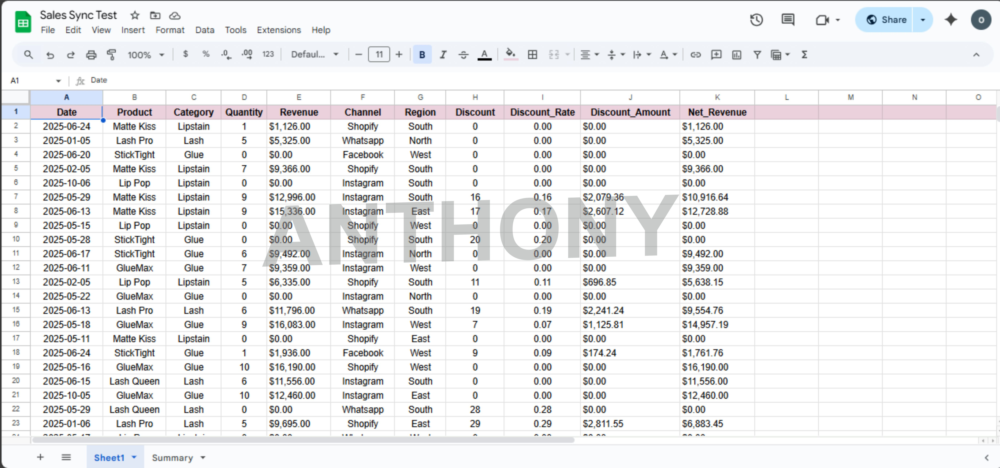
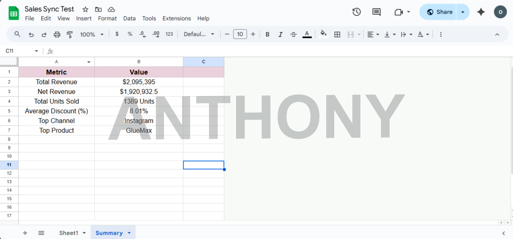
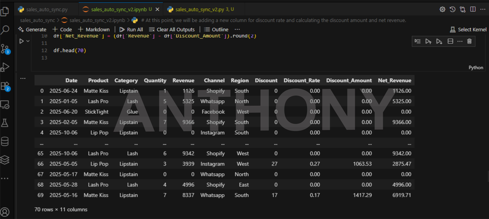
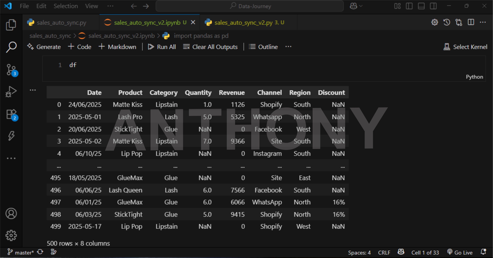

# 🧾 Sales Auto-Sync

A Python automation script that syncs your local CSV sales file directly into a Google Sheet.

It:
- Cleans and formats sales data using Pandas
- Clears and updates the target sheet
- Adds a live timestamp for sync tracking
- Fully customizable for any small business workflow

---

## 🚀 Tech Stack
- Python
- Pandas
- gspread (Google Sheets API wrapper)
- Google Service Account
- Jupyter / VS Code

---

Screenshots:
Cleaned Dataset Main Tab

### Cleaned-Dataset-Summary-Tab

### Clean Dataset

### Dirty Dataset

---

## 📁 Sample File

Ideal Use Cases:
Retail shops
Service-based businesses
Freelancers managing client reports
Anyone tired of manually copying data into Google Sheets

Coming Soon:
Automatic email notifications after sync
Google Drive file creation
Dashboard version with metrics

Author:
https://www.linkedin.com/in/onwuagba-anthony/
